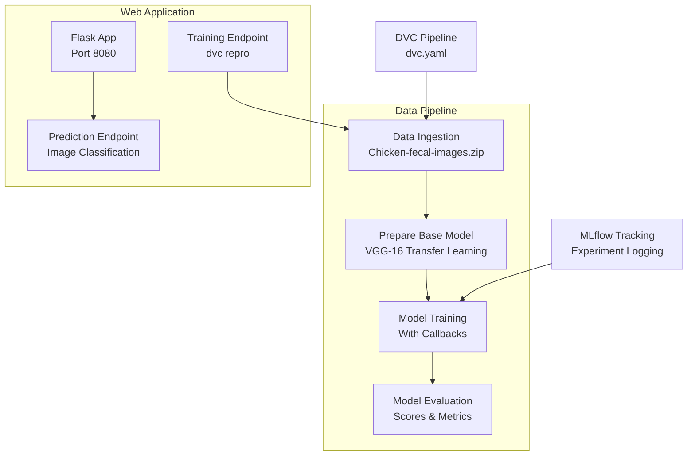

# End-to-End Deep Learning Project: Chicken Disease Classification Using MLOPS DVC Pipeline With Deployments

## Overview

This project implements an end-to-end **Chicken Disease Classification System** using Convolutional Neural Networks (CNN) with Transfer Learning. The system leverages MLOPS (Machine Learning Operations) tools to create a robust, production-ready pipeline for model training, version control, experimentation tracking, and deployment.

### Key Technologies
- **Machine Learning**: TensorFlow, Transfer Learning (VGG-16)
- **MLOPS Tools**: DVC (Data Version Control), MLflow (Experiment Tracking)
- **Web Framework**: Flask with CORS support
- **Deployment**: Docker, AWS (EC2, ECR), CI/CD with GitHub Actions
- **Data Processing**: Pandas, NumPy, SciPy
- **Visualization**: Matplotlib, Seaborn

## Features

- ✅ **Modular CNN Architecture**: Transfer Learning with VGG-16 backbone
- ✅ **Automated Pipeline**: DVC-managed workflow (Data Ingestion → Model Preparation → Training → Evaluation)
- ✅ **Experiment Tracking**: MLflow for hyperparameters, metrics, and model versioning
- ✅ **Web Interface**: Flask-based UI for easy model interaction
- ✅ **API Endpoints**: RESTful APIs for training and prediction
- ✅ **Production Deployment**: AWS CI/CD pipeline with Docker containerization
- ✅ **Version Control**: DVC for data and model artifacts
- ✅ **Configuration Management**: YAML-based config for flexible parameter tuning

## Architecture & Project Structure



### Directory Structure

```
.
├── .gitignore                    # Git ignore patterns
├── app.py                        # Flask web application
├── main.py                       # Main pipeline execution script
├── dvc.yaml                      # DVC pipeline configuration
├── params.yaml                   # Hyperparameter configuration
├── requirements.txt              # Python dependencies
├── setup.py                      # Package setup configuration
├── template.py                   # Template utilities
├── LICENSE                       # Project license
├── README.md                     # Basic project documentation
├── config/
│   └── config.yaml               # Path configurations
├── src/cnnClassifier/            # Main package
│   ├── __init__.py
│   ├── components/
│   │   ├── data_ingestion.py     # Data download and extraction
│   │   ├── evaluation.py         # Model evaluation metrics
│   │   ├── model_trainer.py      # Training logic
│   │   └── prepare_base_model.py # Transfer learning setup
│   ├── config/
│   │   ├── configuration.py      # Configuration manager
│   │   └── __init__.py
│   ├── constants/
│   │   └── __init__.py           # Project constants
│   ├── entity/
│   │   ├── config_entity.py      # Configuration dataclasses
│   │   └── __init__.py
│   ├── logger/
│   │   └── __init__.py           # Logging utilities
│   ├── pipeline/
│   │   ├── data_ingestion_pipeline.py
│   │   ├── evaluate.py
│   │   ├── predict.py            # Prediction pipeline
│   │   ├── prepare_base_model_pipeline.py
│   │   ├── stage_03_model_trainer.py
│   │   └── stage_04_evaluation.py
│   └── utils/
│       ├── common.py             # Common utilities
│       └── __init__.py
├── research/                     # Jupyter notebooks for experimentation
├── templates/
│   └── index.html                # Web UI template
└── artifacts/                    # DVC-managed outputs (created during execution)
```

## Installation & Setup

### Prerequisites
- Python 3.8+
- Docker (for deployment)
- AWS CLI (for cloud deployment)
- Git

### Local Setup

1. **Clone the repository**
   ```bash
   git clone <repository-url>
   cd End-To-End-Deep-Learning-Project-Using-MLOPS-DVC-Pipeline-With-Deployments
   ```

2. **Create virtual environment**
   ```bash
   python -m venv venv
   source venv/bin/activate  # On Windows: venv\Scripts\activate
   ```

3. **Install dependencies**
   ```bash
   pip install -r requirements.txt
   ```

4. **Setup DVC**
   ```bash
   dvc init
   dvc repro  # Execute the complete pipeline
   ```

5. **Configure MLflow (Optional)**
   ```bash
   export MLFLOW_TRACKING_URI=https://dagshub.com/entbappy/chest-Disease-Classification-MLflow-DVC.mlflow
   export MLFLOW_TRACKING_USERNAME=entbappy
   export MLFLOW_TRACKING_PASSWORD=your_password
   ```

## Usage

### Training Pipeline

1. **Update Configuration**
   - Modify `config/config.yaml` for data paths
   - Update `params.yaml` for hyperparameters

2. **Execute Training**
   ```bash
   # Complete pipeline execution
   dvc repro

   # Or run individual stages
   python src/cnnClassifier/pipeline/stage_01_data_ingestion.py
   python src/cnnClassifier/pipeline/stage_02_prepare_base_model.py
   python src/cnnClassifier/pipeline/stage_03_training.py
   python src/cnnClassifier/pipeline/stage_04_evaluation.py
   ```

3. **Monitor Training**
   - View TensorBoard logs: `tensorboard --logdir artifacts/prepare_callbacks/tensorboard_log_dir`
   - Check MLflow experiments: `mlflow ui`

### Web Application

1. **Start the Flask App**
   ```bash
   python app.py
   ```

2. **Access Web Interface**
   - Open browser: http://localhost:8080
   - Upload chicken fecal images for classification

### API Usage

#### Endpoints

- **GET /** - Web interface home page
- **GET /train** - Trigger model training (`dvc repro`)
- **POST /predict** - Image classification prediction

#### Prediction Example
```python
import requests
import base64

with open('chicken_image.jpg', 'rb') as img:
    img_data = base64.b64encode(img.read()).decode()

response = requests.post('http://localhost:8080/predict', 
                        json={'image': img_data})
print(response.json())
```

### DVC Commands

```bash
dvc init          # Initialize DVC
dvc repro         # Execute pipeline
dvc dag           # Visualize pipeline DAG
dvc params diff   # Check parameter changes
```

## MLOPS Integration

### DVC Pipeline
- **Data Versioning**: Track data changes and dependencies
- **Reproducible Pipelines**: Automated workflow execution
- **Storage Optimization**: Efficient artifact management

### MLflow Tracking
- **Experiment Management**: Log parameters, metrics, and artifacts
- **Model Registry**: Version and stage models
- **UI Dashboard**: Web interface for experiment comparison

## Deployment

### AWS CI/CD Pipeline

1. **IAM User Setup**
   ```bash
   # Create IAM user with EC2 and ECR full access
   # Store credentials in GitHub Secrets
   ```

2. **ECR Repository**
   ```bash
   aws ecr create-repository --repository-name chicken-disease-classifier
   ```

3. **EC2 Instance**
   ```bash
   # Launch Ubuntu EC2 instance
   # Configure as GitHub self-hosted runner
   ```

4. **GitHub Secrets**
   - `AWS_ACCESS_KEY_ID` - Your AWS access key
   - `AWS_SECRET_ACCESS_KEY` - Your AWS secret key
   - `AWS_REGION` - us-east-1
   - `AWS_ECR_LOGIN_URI` - ECR login URI
   - `ECR_REPOSITORY_NAME` - chicken-disease-classifier

### Docker Deployment

1. **Build Image**
   ```bash
   docker build -t chicken-disease-classifier .
   ```

2. **Run Container**
   ```bash
   docker run -p 8080:8080 chicken-disease-classifier
   ```

### Local Docker Setup
```bash
# Pull from ECR
aws ecr get-login-password --region us-east-1 | docker login --username AWS --password-stdin <ECR_URI>
docker pull <ECR_URI>/chicken-disease-classifier:latest
docker run -p 8080:8080 <ECR_URI>/chicken-disease-classifier:latest
```

## Configuration

### params.yaml
```yaml
IMAGE_SIZE: 224
INCLUDE_TOP: false
CLASSES: 2
WEIGHTS: imagenet
LEARNING_RATE: 0.01
EPOCHS: 10
BATCH_SIZE: 16
AUGMENTATION: true
```

### config.yaml
Contains paths for:
- Data ingestion directories
- Base model artifacts
- Training outputs
- Callback configurations

## Troubleshooting

### Common Issues

1. **DVC Pipeline Errors**
   - Ensure all dependencies are installed
   - Check data URLs in config.yaml
   - Verify artifact directories exist

2. **AWS Deployment**
   - Validate IAM permissions
   - Confirm EC2 Docker installation
   - Check GitHub secret configurations

3. **Model Training**
   - Verify data dataset availability
   - Check GPU/CPU memory allocation
   - Monitor TensorBoard for overfitting

## Contributing

1. Fork the repository
2. Create a feature branch: `git checkout -b feature-name`
3. Make changes with proper logging
4. Run DVC pipeline: `dvc repro`
5. Test MLflow tracking
6. Submit pull request

### Development Workflow
- Use DVC for experiment tracking
- Log all experiments with MLflow
- Follow the existing project structure
- Update documentation for new features

## License

This project is licensed under the MIT License - see the [LICENSE](LICENSE) file for details.

## Contact

For questions or suggestions, please open an issue in the repository or contact the maintainers.

---

**Note**: This README assumes familiarity with Python, Docker, and AWS services. For detailed tutorials, refer to the documentation sections above.